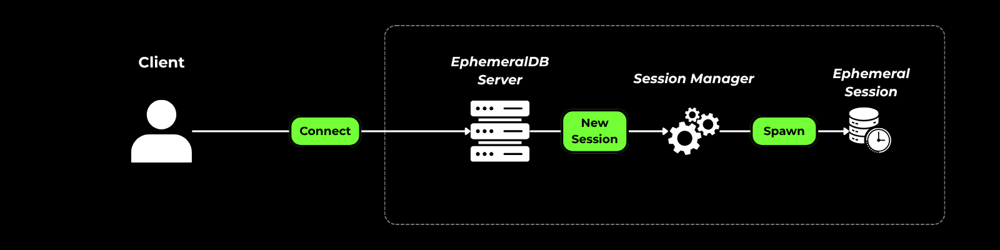
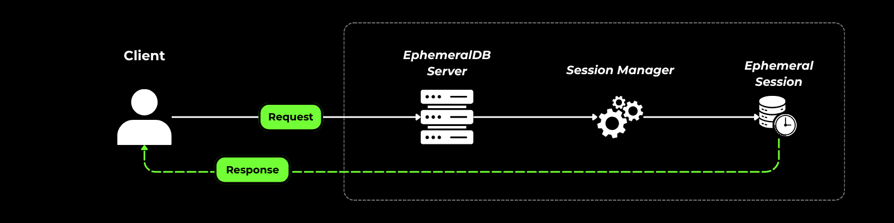
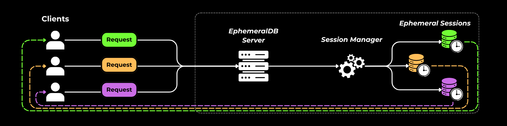
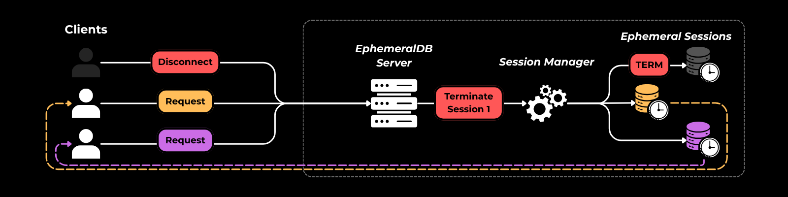

# Ephemeral


**Short-lived data, managed in memory: fast, memory-safe, and sustainable.**

Ephemeral is a lightweight socket server for managing data in memory during short-lived sessions.

It is built around three principles:

- **Least privilege**
- **Right-sizing**
- **If there is no owner, recycle**

## Is Ephemeral a good fit?

Ephemeral may fit your project if:

- Your application needs to run on low-end hardware.
- You need basic CRUD operations with low overhead.
- Multiple processes need to share data without adding much application complexity.
- You want session data to disappear when the session ends.

## How it works

When it starts, the **EphemeralDB server** listens for connections on the configured IP address and port.

### Connecting

When a client connects, the server creates a session and registers it with the `SessionManager`, which tracks updates for that session.



### Interacting

The server routes each client request to the corresponding session and returns a response.



Multiple clients can connect at the same time.



### Disconnecting

When a client disconnects, its session is terminated. The session's data is removed and its resources are released without affecting other sessions.



Session data is held in memory. It is wiped when the session ends and is not cached or persisted in a database.

## Installation

Ephemeral is written in Rust. You need the rust toolchain and cargo to build it from source.

### Prerequisites

- [Rust and Cargo](https://www.rust-lang.org/tools/install)

Check that Rust and Cargo are available:

```bash
rustc --version
cargo --version

# Build it from Source

git clone https:/github.com/Starblessed/ephemeral
cd ephemeral
cargo build --release
```

The executable will be created at: `target/release/ephemeral.(exe or bin)`

## Example usage

### From source

#### Clone the repository

Clone the repository from github and move into it

```bash
git clone https:/github.com/Starblessed/ephemeral
cd ephemeral
```

#### Copy and edit the .env file

Copy the .env.example file into a .env file

```bash
cp .env.example .env
```

Change the IP and Port fields as you prefer

```ini
IP=0.0.0.0 # Change here
PORT=8411 # Change here
RUST_LOG=info # Keep this
```

#### Run the application

```bash
cargo run
```

### Standalone

After building the application, simply run:

```bash
target/release/ephemeral IP PORT # Inform the IP and port
```

### Docker

#### Copy and edit the .env file

Copy the .env.example file into a .env file

```bash
cp .env.example .env
```

#### Build and Compose

Build the docker image with docker compose and run it

```bash
docker compose -d ephemeral --build
```

### Client

There are 5 different commands to use on an Ephemeral Session

| Command | Description | Input | Request Example |
| :--- | :--- | :--- | :--- |
| get | Gets the whole map of session stored data. | N/A | <pre><code class="language-json">{<br>  "cmd": "get"<br>}</code></pre> |
| get_partial | Gets a map of selected keys | List of desired keys | <pre><code class="language-json">{<br>  "cmd": "get_partial",<br>  "payload": ["key1", "key2, "key3"]<br>}</code></pre> |
| set | Overwrites the entire map with the provided data | A json object | <pre><code class="language-json">{<br>  "cmd": "set",<br>  "payload": {<br>    "key1": value1, <br>    "key2": value2, <br>    "key3": value3<br>  }<br>}</code></pre> |
| set_partial | Updates the existing data with the provided json object | A json object | <pre><code class="language-json">{<br>  "cmd": "set_partial",<br>  "payload": {<br>    "key1": value1, <br>    "key2": value2, <br>    "key3": value3<br>  }<br>}</code></pre> |
| wipeout | Deletes session data. | N/A | <pre><code class="language-json">{<br>  "cmd": "wipeout"<br>}</code></pre> |

## Contributing

Contributions are welcome. Please open an issue to discuss a proposed change before submitting a pull request.

For more information, contact me at:
 dannylo@starblessed.dev

## License and authors

- **License:** [MIT License](LICENSE)
- **Author(s):** Dannylo "Starblessed" Maurício